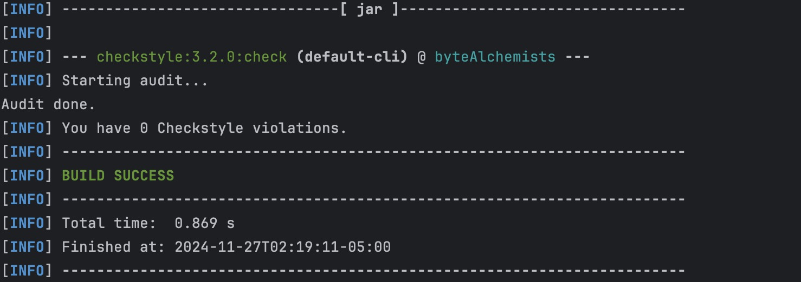
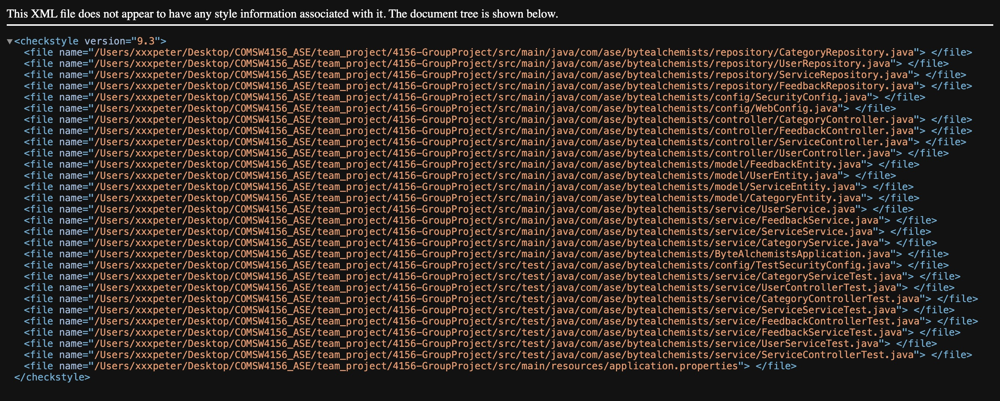
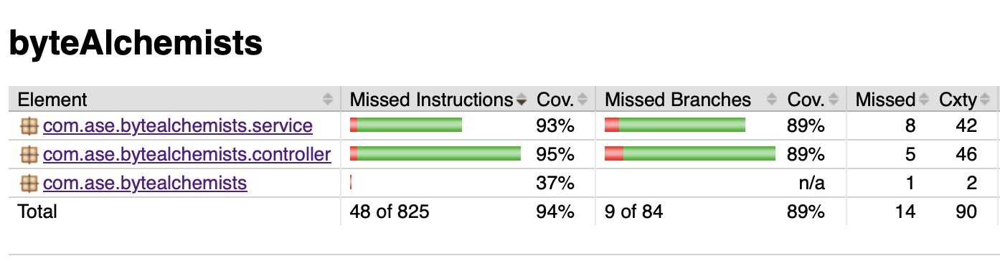
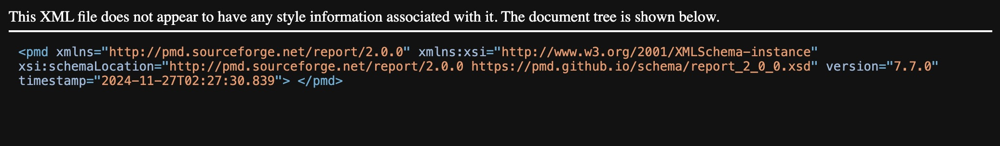

# Homeless Support API


## Table of Contents

- [Introduction](#introduction)
- [Team Information](#team-information)
- [Prerequisites](#prerequisites)
- [Installation](#installation)
- [Usage](#usage)
  - [API Endpoints](#api-endpoints)
- [Style Checking and Documentation](#style-checking-and-documentation)
- [Project Management](#project-management)


## Introduction

Welcome to the **Homeless Support API** by **Byte Alchemists**. This API is designed to assist individuals experiencing homelessness by providing access to essential resources, services, and information. Our goal is to improve the quality of life for homeless individuals by connecting them with vital support systems and enabling service providers to manage and deliver resources efficiently.

## Team Information

**Team Name:** Byte Alchemists

| Team Member # | Name          | UNI    |
|---------------|---------------|--------|
| 1             | Zihao Cui     | zc2715 |
| 2             | Linshuo Li    | ll3815 |
| 3             | Zhentao Yang  | zy2679 |
| 4             | Ruoxing Liao  | rl3392 |
| 5             | Zhicheng Zou  | zz3105 |

## Prerequisites

Before you begin, ensure you have met the following requirements:

- **Git**: Installed on your local machine. [Download Git](https://git-scm.com/downloads)
- **Java JDK**: Version 17 or higher. [Download JDK](https://www.oracle.com/java/technologies/javase-jdk11-downloads.html)
- **Maven**: For building the project. [Install Maven](https://maven.apache.org/install.html)
- **Postman**: For API testing. [Download Postman](https://www.postman.com/downloads/)
- **IDE**: Such as IntelliJ IDEA or Eclipse for development.

## Installation

Follow these steps to set up the project locally:

1. **Clone the Repository**

   ```bash
   git clone git@github.com:czh2152215/4156-GroupProject.git
   ```

2. **Build the Project**

   Use Maven to build the project:

   ```bash
   mvn clean install
   ```

3. **Run the Application**

   ```bash
   mvn spring-boot:run
   ```

   The API will be accessible at `http://localhost:8080`.


4. **Style Check**

   ```bash
   mvn checkstyle:check 
   mvn checkstyle:checkstyle
   ```

5. **Run Test and Generate Coverage Report**

   ```bash
   mvn clean test jacoco:report
   ```

5. **Run PMD**

   ```bash
   mvn pmd:pmd
   ```
## Usage

### API Endpoints

Our API provides various endpoints to manage and access homeless support services. Below is the documentation for each operational entry point.

#### 1. **Get All Services**

- **Endpoint:** `GET /services`
- **Description:** Retrieves all services across all categories.
- **Response:**
  - **Status Code:** `200 OK`
  - **Body:** JSON array of all `ServiceEntity` objects.

#### 2. **Get All Service Categories**

- **Endpoint:** `GET /services/categories`
- **Description:** Retrieves all available service categories.
- **Response:**
  - Status Code:
    - `200 OK`
    - `204 No Content`: If no categories are available.
    - `500 Internal Server Error`: If an exception occurs during the operation.
  - Body:
    - 200 OK: A plain text string where the category names are joined by commas.
    - 204 No Content: No body, indicating there are no categories available.
    - 500 Internal Server Error: A plain text message like "An Error has occurred" in case of an exception.

#### 3. **Add a New Category**

- **Endpoint:** `POST /services/categories/name/{name}`
- **Description:** Adds a new service category based on the category name.
- **Request Body:**
  ```json
  {
    "category_name": "shelters"
  }
  ```
- **Response:**
  - Status Code:
    - `200 OK`
    - `400 Bad Request`
    - `409 Conflict`
    - `500 Internal Server Error`
  - Body:
    - 200 OK: JSON Object of `Category Entity`.
    - 400 Bad Request: An error message like "Invalid category name."
    - 409 Conflict: An error message like "Category already exists."
    - 500 Internal Error: A plain text message like "An error has occurred" in case of an exception.


#### 4. **Delete a Category**

- **Endpoint:** `DELETE /services/categories/name/{name}`
- **Description:** Deletes an existing service category.
- **Response:**
  - **Status Code:** `If success, returns a success message with HTTP status 200 (OK), otherwise 404 Not Found`

#### 5. **Register a New Service**

- **Endpoint:** `POST /services/{category}`
- **Description:** Registers a new service under a specified category.
- **Path Parameter:**
  - `category`: The category under which to register the service (e.g., `shelters`, `food_banks`, `healthcare_centers`).
- **Request Body:**
  ```json
  {
    "name": "Shelter A",
    "category": "shelters",
    "latitude": 40.7128,
    "longitude": -74.0060,
    "address": "123 Main St",
    "city": "New York",
    "state": "NY",
    "zipcode": "10001",
    "contact_number": "123-456-7890",
    "operation_hour": "9 AM - 5 PM",
    "availability": true
  }
  ```
- **Response:**
  - **Status Code:** `201 Created`
  - **Body:** Success message.

#### 6. **Get Service by ID**

- **Endpoint:** `GET /services/{id}`
- **Description:** Retrieves details of a specific service by its ID.
- **Path Parameter:**
  - `id`: The unique identifier of the service.
- **Response:**
  - **Status Code:** `200 OK`
  - **Body:** JSON object of the `ServiceEntity`.

#### 7. **Update Service by ID**

- **Endpoint:** `PUT /services/{id}`
- **Description:** Updates details of a specific service by its ID. Supports both full and partial updates.
- **Path Parameter:**
  - `id`: The unique identifier of the service.
- **Request Body:** Partial or full `ServiceEntity` JSON object.
  - **Full Update Example:**
    ```json
    {
      "name": "Updated Shelter A",
      "category": "shelters",
      "latitude": 40.7128,
      "longitude": -74.0060,
      "address": "456 New St",
      "city": "New City",
      "state": "NY",
      "zipcode": "10002",
      "contact_number": "987-654-3210",
      "operation_hour": "10 AM - 6 PM",
      "availability": false
    }
    ```
  - **Partial Update Example:**
    ```json
    {
      "name": "Updated Shelter A",
      "city": "New City"
    }
    ```
- **Response:**
  - **Status Code:** `200 OK`
  - **Body:** JSON object of the updated `ServiceEntity`.

#### 8. **Delete Service by ID**

- **Endpoint:** `DELETE /services/{id}`
- **Description:** Deletes a specific service by its ID.
- **Path Parameter:**
  - `id`: The unique identifier of the service.
- **Response:**
  - **Status Code:** `204 No Content`

#### 9. **Query Services**

- **Endpoint:** `GET /services/query`
- **Description:** Retrieves services based on query parameters.
- **Query Parameters:**
  - `latitude` (optional): Latitude for location-based search.
  - `longitude` (optional): Longitude for location-based search.
  - `category` (optional): Category of services to filter.
  - `availability` (optional): Availability status (`true` or `false`).
- **Example Request:**
  ```
  GET /services/query?latitude=40.748817&longitude=-73.985428&category=shelters&availability=true
  ```
- **Response:**
  - **Status Code:** `200 OK`
  - **Body:** JSON array of matching `ServiceEntity` objects.

#### 10. **User Signup**

- **Endpoint:** `POST /user/signup`
- **Description:** create an account for user based on query parameters.
- **Query Parameters:**
  - `username`: Username the user want to set.
  - `email`: Email address of the user.
  - `password`: Password of the account the user wants to set.
  - `firstName`: User's first name.
  - `lastName`: User's last name.
- **Response:**
  - **Status Code:** `201 CREATED`; **Body:** "User registered successfully.".
  - **Status Code:** `409 CONFLICT`; **Body:** "Username or email already exists.".
  - **Status Code:** `500 INTERNAL SERVER ERROR`; **Body:** "An error occurred while registering the user.".

#### 11. **User Login**

- **Endpoint:** `POST /user/login`
- **Description:** login the existing account.
- **Query Parameters:**
  - `username`: Username the user set before.
  - `password`: Password the user set before.
- **Response:**
  - **Status Code:** `200 OK`; **Body:** JSON object of showing userId and message: "Login successful".
  - **Status Code:** `400 BAD REQUEST`; **Body:** "Username cannot be blank"/"Password cannot be blank".
  - **Status Code:** `401 UNAUTHORIZED`; **Body:** "Invalid credentials".
  - **Status Code:** `404 NOT FOUND`; **Body:** "User not found".
  - **Status Code:** `500 INTERNAL SERVER ERROR`; **Body:** "An error occurred during login".

#### 12. **User ResetPassword**

- **Endpoint:** `POST /user/resetPassword`
- **Description:** reset password for the existing account.
- **Query Parameters:**
  - `username`: Username the user set before.
  - `newPassword`: New password the user wants to set.
- **Response:**
  - **Status Code:** `200 OK`; **Body:** "Password updated successfully.".
  - **Status Code:** `400 BAD REQUEST`; **Body:** "Username cannot be blank"/"Password cannot be blank".

#### 13. **Deleter User**

- **Endpoint:** `DELETE /user/{username}`
- **Description:** Delete the existing user by username.
- **Query Parameters:**
  - `username`: Username the user set before.
- **Response:**
  - **Status Code:** `201 CREATED`; **Body:** "User was deleted successfully.".
  - **Status Code:** `404 NOT FOUND`; **Body:** "This user does not exist.".
  - **Status Code:** `500 INTERNAL SERVER ERROR`; **Body:** "An error occurred.".

#### 14. **Create Feedback**

- **Endpoint:** `POST /services/feedback`
- **Description:** Create a feedback
- **Query Parameters:**
  - `userId`: The user's id.
  - `serviceId`: Service Id in which the user want to leave comments for.
  - `comment`: Comment the user wants to leave
  - `rating`: Rating score the user wants to leave, range from 1 to 5.
- **Response:**
  - **Status Code:** `200 OK`; **Body:** JSON object of feedback entity.
  - **Status Code:** `500 INTERNAL SERVER ERROR`; **Body:** "An error occurred while creating the feedback.".

#### 15. **Get Feedbacks From Service ID**

- **Endpoint:** `GET /services/{serviceId}/feedback`
- **Description:** Get feedbacks from a service based on its service ID.
- **Query Parameters:**
  - `serviceId`: The ID of the specific service.
- **Response:**
  - **Status Code:** `200 OK`; **Body:** An array of feedback entity.
  - **Status Code:** `500 INTERNAL SERVER ERROR`; **Body:** "An error occurred.".

#### 16. **Get Feedbacks From Feedback ID**

- **Endpoint:** `GET /services/feedback/{feedback_Id}`
- **Description:** Get a feedback based on feedback ID.
- **Query Parameters:**
  - `feedback_Id`: The ID of the specific feedback.
- **Response:**
  - **Status Code:** `200 OK`; **Body:** JSON Object of feedback entity.
  - **Status Code:** `404 NOT FOUND`; **Body:** "Feedback with `feedbackId` not found.".
  - **Status Code:** `500 INTERNAL SERVER ERROR`; **Body:** "An error occurred.".

#### 17. **Delete Feedbacks Based on Feedback ID**

- **Endpoint:** `DELETE /services/feedback/{feedback_Id}`
- **Description:** Delete a feedback based on feedback ID.
- **Query Parameters:**
  - `feedback_Id`: The ID of the specific feedback.
- **Response:**
  - **Status Code:** `200 OK`; **Body:** "Feedback was deleted successfully.".
  - **Status Code:** `404 NOT FOUND`; **Body:** "This feedback does not exist.".
  - **Status Code:** `500 INTERNAL SERVER ERROR`; **Body:** "An error occurred.".

### Style Checker Report

We utilize **Checkstyle** to enforce coding standards. Reports are included in the repository under the `reports/` directory.
Here is the report as of the day of 11/27/24:



### Branch Coverage Reporting ###

We use JaCoCo to perform branch analysis in order to see the branch coverage of the relevant code 
within the code base. See below for screenshots demonstrating output:


### Static Code Analysis ###
We used PMD to perform static analysis on our codebase, see below for the most recent output:


### Continuous Integration Report ##
Waiting to update

### Documentation
Our codebase adheres to the **Java Code Conventions** and is compliant with **Checkstyle** for style checking. All non-trivial code includes proper documentation using **Javadoc**.

- **Javadoc:** All classes and major methods are documented using Javadoc. You can generate the documentation using Maven:

  ```bash
  mvn javadoc:javadoc
  ```

  The generated documentation will be located in the `target/site/apidocs/` directory.

## Project Management

We use **Jira** for project management. The board includes all tasks, assignments, and progress tracking for team members.

- **Jira Board Link:** [Byte Alchemists Jira](https://columbia-team-skl5pnkl.atlassian.net/jira/software/projects/KAN/list)


### Branch Protection Rules

Our `main` branch is protected with the following rules:

- **Required Reviews:** At least one team member must review and approve the pull request.
- **Commit Message Standards:** All commit messages must be meaningful and describe the changes made.


